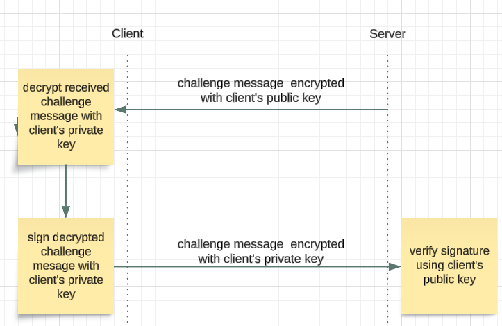
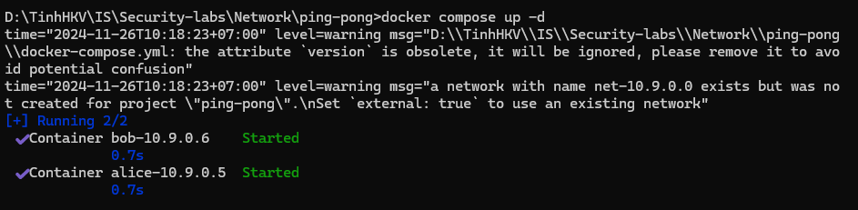
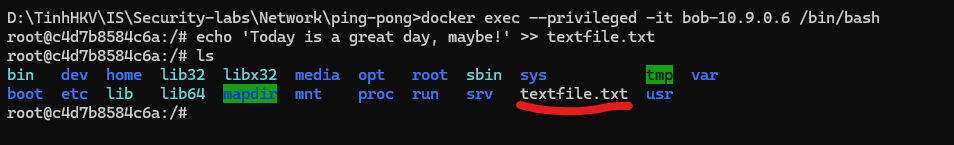
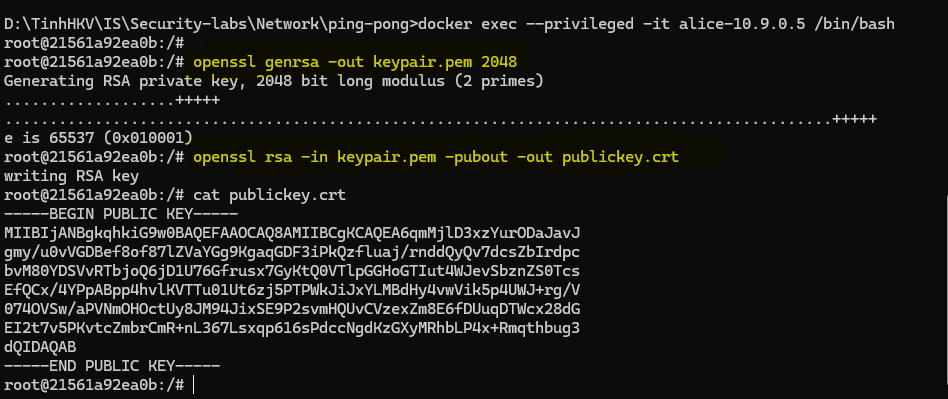
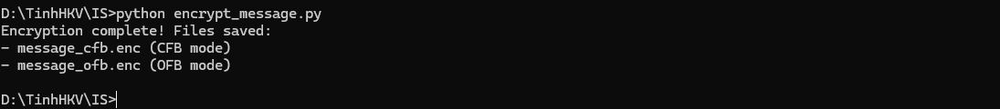
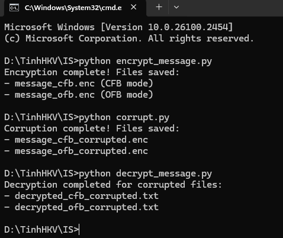
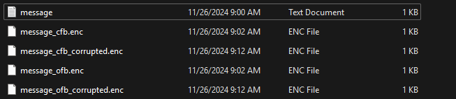

 **Student ID:** 22110077
**Name:** Nguyen Thanh Tinh
**Course:** INSE330380E_02FIE

# Task 1: Public-key based authentication 
**Question 1**: 
Implement public-key based authentication step-by-step with openssl according the following scheme.


**Answer 1**:
***Step 1: Set up enviroment***
- Alice (server): IP 10.9.0.5
- Bob (client): IP 10.9.0.6

Then, Bob will create a text file that will be securely sent to Alice.


***Step 2: Generate Key***
- On Alice machine, she generates a private key by using the RSA algorithm: `openssl genrsa -out keypair.pem 2048`

with:
- **openssl genrsa:** Generates an RSA private key.
- **out keypair.pem:** Saves the private key to keypair.pem.
- **2048:** Sets the RSA key length to 2048 bits, which balances security and performance.

And then, from the private key, extract the public key: `openssl rsa -in keypair.pem -pubout -out publickey.crt`

with
- **in keypair.pem:** Input the private key.
- **pubout:** Extract the public key.
- **out publickey.crt:** Save the public key to publickey.crt.



Step 3: Transfer public key to Bob
Before transferring, both of them must grant permissions to ensure the public key file is accessible:
`chmod 777 /home`
Now, Alice sends public key to Bob by using scp:

If the SSH server is not running on Bob's machine, please do:
```bash
apt update
apt install openssh-server
service ssh start
```

# Task 2: Encrypting large message 
Create a text file at least 56 bytes.

#### **Question 1: Encrypt the file with aes-256 cipher in CFB and OFB modes. How do you evaluate both cipher as far as error propagation and adjacent plaintext blocks are concerned.**

**Answer 1**:
***Step 1: Create a Text File***
Here, I have created a `message.txt` with a size of at least 56 bytes:

```bash
Hello, my name is Nguyen Thanh Tinh, my id is 22110077, and I happy to help you. Hope you having a wonderful day! Today, I have a really important test but my health is not OK. I have not sleep for 2 days and I'm having a slight fever . I hope I can do my best to have a high score. That's all for today. Bye bye!
```

***Step 2: Write and Execute the Encryption Script***
Next step, I'll use Python with the `pycryptodome` library to implement the encryption. The key components included:
- **Key:** A 256-bit (32-byte) key to meet AES-256 requirements.
- **IV:** A random 16-byte value to ensure unique encryption for every operation.
- **Modes:**
  - CFB (Cipher Feedback)
  - OFB (Output Feedback)

And here is the encryption process included:
1. Loading the plaintext file.
2. Encrypting the file using AES-256 in both modes.
3. Writing the ciphertext to separate files: `message_cfb.enc` and `message_ofb.enc`.

##### **Code Overview**
At here, i have created `encrypt_message.py` file to do the encryption in 2 modes.

```python
from Crypto.Cipher import AES
from Crypto.Util.Padding import pad
import os

# Load the plaintext file
with open("message.txt", "rb") as f:
    plaintext = f.read()

# Define a 256-bit key (32 bytes) and a random IV (16 bytes)
key = b"mysecretkeyissupersecuren32bytes"  
iv = os.urandom(16)

# Encrypt using AES-256 in CFB mode
cipher_cfb = AES.new(key, AES.MODE_CFB, iv=iv)
ciphertext_cfb = cipher_cfb.encrypt(plaintext)
with open("message_cfb.enc", "wb") as f:
    f.write(iv + ciphertext_cfb)

# Encrypt using AES-256 in OFB mode
cipher_ofb = AES.new(key, AES.MODE_OFB, iv=iv)
ciphertext_ofb = cipher_ofb.encrypt(plaintext)
with open("message_ofb.enc", "wb") as f:
    f.write(iv + ciphertext_ofb)

print("Encryption complete! Files saved:")
print("- message_cfb.enc (CFB mode)")
print("- message_ofb.enc (OFB mode)")

```

This script will generate two encrypted files: 
- `message_cfb.enc` (encrypted using CFB mode).
- `message_ofb.enc` (encrypted using OFB mode).

***Result:***
After executing the script, both files were successfully generated. The encryption process was verified by checking the sizes of the output files, which included the IV and the ciphertext.


And this is the `message.txt` file and the 2 encryption file. Now you can check the sixe of the output files


#### **Evaluation of Modes**

| Feature                | **CFB Mode**                          | **OFB Mode**                         |
| ---------------------- | ------------------------------------- | ------------------------------------ |
| **Error Propagation**  | Affects current and next block        | Affects only corresponding bit       |
| **Plaintext Handling** | Conceals patterns; feedback-dependent | Conceals patterns; keystream-based   |
| **Use Case**           | Streaming, real-time communication    | File transfers, high error tolerance |

___

#### **Question 2: Modify the 8th byte of encrypted file in both modes (this emulates corrupted ciphertext). Decrypt corrupted file, watch the result and give your comment on Chaining dependencies and Error propagation criteria.**

**Answer 2:**
**Step 1. Modify the 8th byte of the encrypted file**
The encrypted files (`message_cfb.enc` and `message_ofb.enc`) were altered by modifying the 8th byte of each file. This simulates ciphertext corruption.

I've created a `corrupt.py` file for this purpose:
```python
def corrupt_file(input_file, output_file, byte_position):
    with open(input_file, "rb") as f:
        data = bytearray(f.read())
    data[byte_position] ^= 0xFF  # Flip all bits of the 8th byte
    with open(output_file, "wb") as f:
        f.write(data)

# Corrupt the 8th byte
corrupt_file("message_cfb.enc", "message_cfb_corrupted.enc", 8)
corrupt_file("message_ofb.enc", "message_ofb_corrupted.enc", 8)

print("Corruption complete! Files saved:")
print("- message_cfb_corrupted.enc")
print("- message_ofb_corrupted.enc")
```

**Step 2. Decrypt the corrupted files**
The corrupted files were decrypted using the original decryption logic for both modes.

Here, I've also created a `decrypt_message.py` file:
```python
def decrypt_file(input_file, key, mode):
    with open(input_file, "rb") as f:
        data = f.read()
    iv, ciphertext = data[:16], data[16:]
    cipher = AES.new(key, mode, iv=iv)
    return cipher.decrypt(ciphertext)

# Define the same key used for encryption
key = b"mysecretkeyissupersecuren32bytes"  

# Decrypt corrupted files
plaintext_cfb_corrupted = decrypt_file("message_cfb_corrupted.enc", key, AES.MODE_CFB)
plaintext_ofb_corrupted = decrypt_file("message_ofb_corrupted.enc", key, AES.MODE_OFB)

print("Decryption completed for corrupted files.")
```

**Step 3. Observe and analyze the results**
The outputs of the corrupted files were compared to the original plaintext to analyze how the corruption affected each mode.




#### **Result**
When i compared those 2 output files, i have a conclusion: 


| **Mode** | **Behavior**                                                                                                                                                        |
| -------- | ------------------------------------------------------------------------------------------------------------------------------------------------------------------- |
| **CFB**  | The corruption in the 8th byte caused errors in the decrypted plaintext for the corresponding block and the next block. However, subsequent blocks were unaffected. |
| **OFB**  | The corruption in the 8th byte affected only the corresponding byte in the plaintext. No further errors were propagated, as OFB does not use chaining.              |

